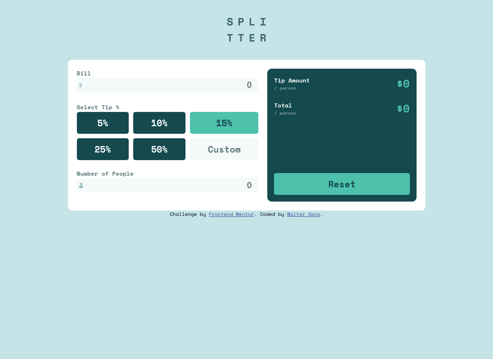

# Frontend Mentor - Tip calculator app solution

This is a solution to the [Tip calculator app challenge on Frontend Mentor](https://www.frontendmentor.io/challenges/tip-calculator-app-ugJNGbJUX). Frontend Mentor challenges help you improve your coding skills by building realistic projects.

## Table of contents

- [Overview](#overview)
  - [The challenge](#the-challenge)
  - [Screenshot](#screenshot)
  - [Links](#links)
- [My process](#my-process)
  - [Built with](#built-with)
- [Author](#author)

## Overview

### The challenge

Users should be able to:

- View the optimal layout for the app depending on their device's screen size
- See hover states for all interactive elements on the page
- Calculate the correct tip and total cost of the bill per person

### Screenshot

### Links

- Solution URL: [Source Code](https://github.com/waltersono/tip-calculator-app)
- Live Site URL: [View on Browser](https://waltersono.github.io/tip-calculator-app/)

## My process

### Built with

- Vanila Javascript
- Semantic HTML5 markup
- Flexbox
- Local Storage
- CSS Theme Design
- Sass
- 7-1 CSS Architecture

## Author

- Frontend Mentor - [@waltersono](https://www.frontendmentor.io/profile/waltersono)
- LinkedIn - [LinkedIn](https://www.linkedin.com/in/waltersono)
